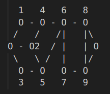
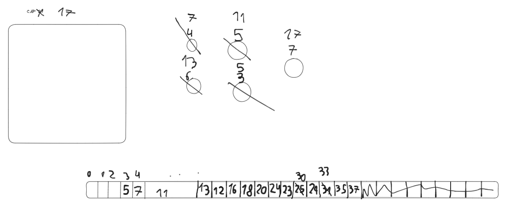

Para el que lea: Si, voy a anotar en un txt

----------------------------------------------------3/5------------------------------------------------------------
# Programacion Dinamica
Problema de ir de la casa a la escuela de diferentes formas -> Grafo dirigido aciclico
Encontrar:
- Estados
- Transiciones

Ambas formas tienen la misma complejidad.
En programacion dinamica siempre la complejidad es
- Cant Nodos + Cant de Transiciones

Posibles Formas:
- Forma Bottom-Up
    Sacar:
    f(9) = 1
    f(7) = f(9) = 1
    f(8) = f(9) + 1 = 2
    f().... e ir calculando en base a los ya calculados desde lo que se hasta lo que no se

- Forma Top-Down
    Hacer una especie de DFS, tener en cuenta que hay que hacer Memorization -> NO recorrer nuevamente los nodos, una vez que ya fue 
    obtenido su valor no volver a hacer el calculo -> Guardarlo en algun lado

----------------------------------------------------10/5------------------------------------------------------------
# Continuacion de Programacion Dinamica
Implementar una solucion para Dice Combinatios que sea TopDown. Hecho en el archivo DiceCombinationsTD.cpp
Problemas famosos:
- Knapsack Problem: Hay una mochila con un maximo de algo y tengo items con la cantidad que ocupan de ese algo y un "valor" determinado.
Como obtengo el maximo "valor" sin superar el maximo de algo?
Para n elementos tengo 2 a la n combinaciones
Por lo que esta idea es imposible de chequear todas la combinaciones, entonces la idea es usar un vector de 0 a w siendo w el tamano de a mochila.
El costo computacional es w * N (estados) + w* N (transiciones)

Para problemas de DP:
atcoder.jp
El knapsack problem 2 es con minimo en lugar de maximos
- Longest increasing subsequence (LIS)
- Longest combination subsequence (LCS)